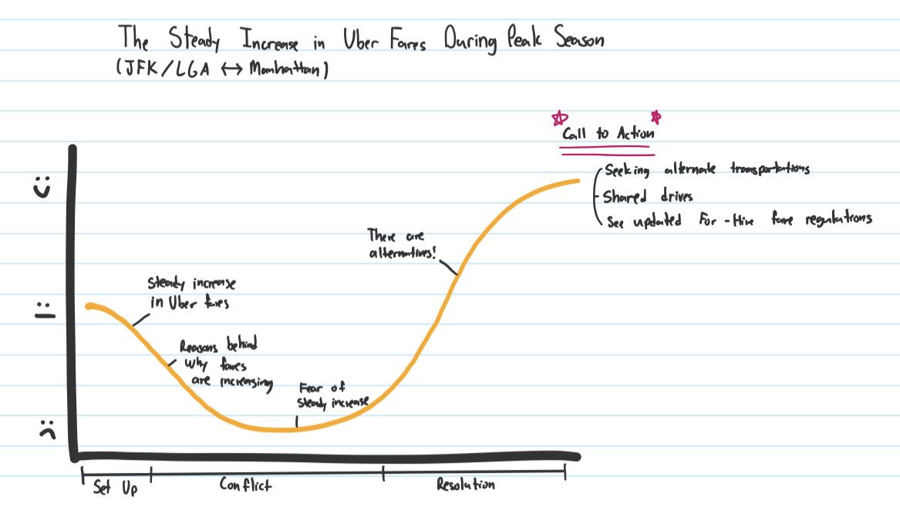

---
---

# Part I: Final Project

## Topic: Steady Increase in Uber Fares in New York City During Peak Season 🚕
## Outline 

**High-level Summary 📝**

This project examines the consistent rise in Uber fares between JFK and LaGuardia (LGA) airports and New York City, particularly during the peak season in June each year. With transportation costs climbing, this topic offers an insightful narrative about how rising fares are impacting both tourists and New Yorkers who rely on rideshare services for airport transfers. The growing cost of Uber rides highlights the tension between convenience and affordability, and the data will explore how these fare hikes affect passenger choices and the overall transportation landscape in New York City.

**Story Arc**

 

**Target Audience**

- Travelers or Tourists who frequently use Uber for airport transportation, especially those traveling to or from JFK and LGA.
- New Yorkers and commuters who are interested in the cost of air travel and the convenience of rideshare services.

**Set Up**

For many travelers flying into New York City, taking an Uber from major airports like JFK and LaGuardia (LGA) has become the go-to choice for convenience. It helps them save time and minimizes the likelihood of having to carry heavy luggage up and down the stairs when traveling between the airport and Manhattan. However, with the rise in fares, travelers are starting to question whether the comfort and convenience of a rideshare are still worth the cost. Once known for its affordability and efficiency, Uber is now seen as an expensive option for airport transport.

**Conflict**

The conflict emerges as both frequent travelers and tourists are confronted with significant fare hikes that strain their travel budgets. As inflation continues to rise, Uber fares are following suit, creating a financial burden for many passengers. This presents an opportunity to explore the reasons behind the price increases, including surge pricing, airport fees, fluctuating fuel prices, and spikes in demand. The growing costs are forcing passengers to reconsider their transportation options, raising the question of whether Uber can remain a viable choice for airport travel.

**Resolution**

- Exploring multi-passenger options
  - Recently, Uber has released an airport shuttle between LGA and Midtown Manhattan. Although it is a temporary service with limited routes, this is an alternate service provided by Uber.
- Examining any signs of regulation or changes that could impact Uber pricing
  - There could be new local, state, or national regulations that influence ride-hailing pricing, which could include government-imposed fare caps, new taxes, or zoning laws affecting ride-sharing operations. Changes in insurance requirements, driver classification, or environmental standards could also influence the cost structure of Uber and similar services, making it important to stay informed about policy shifts that might increase or decrease pricing.
- Seeking alternate and more affordable transportation
  - Express airport shuttles: These shuttles often have set schedules and are a more cost-effective choice compared to traditional ride-hailing. They may also provide a more reliable service since they are dedicated to airport transport.
  - Group ride-sharing companies: These services allow you to share a ride with others going to similar locations, significantly lowering the fare.
  - Arising new for-hire companies (Revel, etc.): Keep an eye on emerging transportation startups like Revel, which offers electric vehicles for hire.

## Sketches 🖼️

**The data presented in the sketches is hypothetical and not official.**

**Set Up**

- Basic data visualization of how many people take the Uber when traveling between JFK/LGA and Manhattan

- Comparing the average fare during peak season annually (JFK -> NYC)

- Comparing the average fare during peak season annually (LGA -> NYC)

**Conflict**

- Data visualization about what goes into the Uber total fare

- Providing data about the fluctuating gas prices

**Resolution**

- Comparison of the average fares between Uber rides and multi-passenger rides.

## Data Sources 💁🏻‍♀️

1. The data provides For-Hire Vehicle (FHV) trip records containing dispatch information, including the base license number and pick-up details. While the TLC publishes these records, they do not guarantee their accuracy or completeness, as they rely on submissions from service providers and perform routine reviews to ensure accuracy.
Source: New York City Taxi and Limousine Commission (TLC). "TLC Trip Record Data." Accessed November 20, 2024. https://www.nyc.gov/site/tlc/about/tlc-trip-record-data.page.

2. The U.S. Energy Information Administration (EIA) provides comprehensive data on gasoline and diesel fuel prices across the United States. This dataset tracks average retail prices for gasoline and diesel fuel by region and by type (regular, premium, etc.). It also includes historical price data, which allows users to analyze fluctuations in fuel costs over time. The data reflects weekly and monthly averages, and factors such as seasonal changes, regional differences, and broader economic influences like supply disruptions or price hikes due to global oil price changes.
Source: U.S. Energy Information Administration. "Gasoline and Diesel Fuel Price Data." Last modified October 27, 2023. https://www.eia.gov/petroleum/gasdiesel/.

## Method and Medium 🖥️

For the completion of my project, I will be using the tools below:
- **Shorthand**
  - To craft and present my story narrative in an engaging
- **Tableau**
  - To design interactive data visualizations that enhance understanding
- **Canva**
  - To create tailored visuals that complement and strengthen my story arc

## Navigate 
| [home page](https://celerysally.github.io/portfolio/) | [visualizing debt](https://celerysally.github.io/portfolio/visualizing_debt.html) | [critique by design](https://celerysally.github.io/portfolio/critique_by_design.html) | [Final Project Part II](https://celerysally.github.io/portfolio/part2.html) | [Final Project Part III](https://celerysally.github.io/portfolio/part3.html) |
