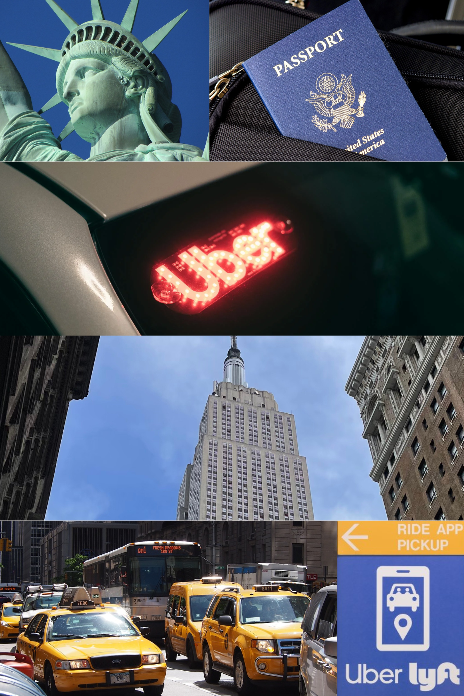

---
---

# Part II: Final Project

## Storyboard ✍️
[Shorthand Storyboard](https://carnegiemellon.shorthandstories.com)

## User Research & Interviews 🕵️‍♀️

### 1. Target Audience 👥

- Travelers or Tourists who frequently use Uber for airport transportation in June, especially those traveling to or from JFK and LGA.
  - Age Range: Primarily 18-55 years old who prioritize comfort and convenience
  - Geographic Location: Domestic and international travelers arriving or departing from New York City, particularly those heading to or from JFK and LGA
  - Tech-Savviness: Comfortable using smartphones and rideshare apps
 
- New Yorkers and commuters who are interested in the cost of air travel and the convenience of rideshare services.
  - Age Range: Primarily 25-50 years old, with a focus on professionals who frequently travel for work or personal reasons
  - Geographic Location: Primarily New York City residents, with a focus on those living in Manhattan, Brooklyn, and Queens
  - Interest in Pricing Trends: May regularly compare different transport options for cost-effectiveness

### 2. Approach to Identifying Representative Individuals to Interview 🤝

Many of my friends and colleagues visit NYC during the summer, many of them being current CMU graduate students who value convenience and comfort when they travel.

To ensure a variety of perspectives based on different usage patterns, I decided to interview:
- An international traveler
- A CMU Phd student who visits NYC every summer
- A music producer who has a busy schedule and travels frequently

### 3. Interview Script 💬

| Question | Interviewee 1 | Interviewee 2 | Interviewee 3 | 
| -------- | ------------- | ------------- | ------------- |
| _What mode of transportation do you typically use to travel between JFK/LGA and NYC?_ | Usually, I take an Uber or Lyft. | 
| _Is there a specific reason for that transportation?_ | I tend to take the most comfortable transportation, especially a 12-14 hour flight. Also, with the big and heavy luggage, I'm not taking them up and down the stairs. | 
| _Who do you think the target audience is?_ | Tourists or anyone visiting NYC. | 
| _Was the content clear to follow?_ | It was clear to follow, although there was a lot of information overall. | 
| _Do the data visualizations align with the main topic?_ | Yes, they clearly align with the topic. |
| _What is one key takeaway?_ | Depending on the location, an Uber trip could cost as much as a flight ticket. That's actually wild. | 
| _Were the visualizations easy to understand?_ | They were simple and easy to understand. |
| _How does the color scheme make you feel?_ | I liked the consistency of colors that you used. I liked how I wasn't overwhelmed with multiple colors. | 
| _If you could make any improvements, what would it be?_ | Could have used other types of charts or graphs. | 

### 4. Findings from the Interviews 🔍

### 5. Changes I Plan on Implementing to My Visualizations 💡

## Moodboard 📓

Source:
- Pixabay. Passport, Flag, Travel, Visa. March 27, 2017. [(https://pixabay.com/photos/passport-flag-travel-visa-2642172/)](https://pixabay.com/photos/passport-flag-travel-visa-2642172/).
- Pixabay. Statue of Liberty, New York, Statue. May 23, 2017. [https://pixabay.com/photos/statue-of-liberty-new-york-statue-267949/](https://pixabay.com/photos/statue-of-liberty-new-york-statue-267949/).
- Pixabay. NYC Taxi, America, Traffic, Manhattan. June 15, 2020. [https://pixabay.com/photos/nyc-taxi-america-traffic-manhattan-4665939/](https://pixabay.com/photos/nyc-taxi-america-traffic-manhattan-4665939/).
- Pexels. A Car with the Word Uber on It. Accessed November 24, 2024. [https://www.pexels.com/photo/a-car-with-the-word-uber-on-it-27639789/](https://www.pexels.com/photo/a-car-with-the-word-uber-on-it-27639789/).
- Philadelphia International Airport. "Ride App Services." Accessed November 24, 2024. [https://www.phl.org/getting-around/ride-app-services](https://www.phl.org/getting-around/ride-app-services).

## Navigate 

