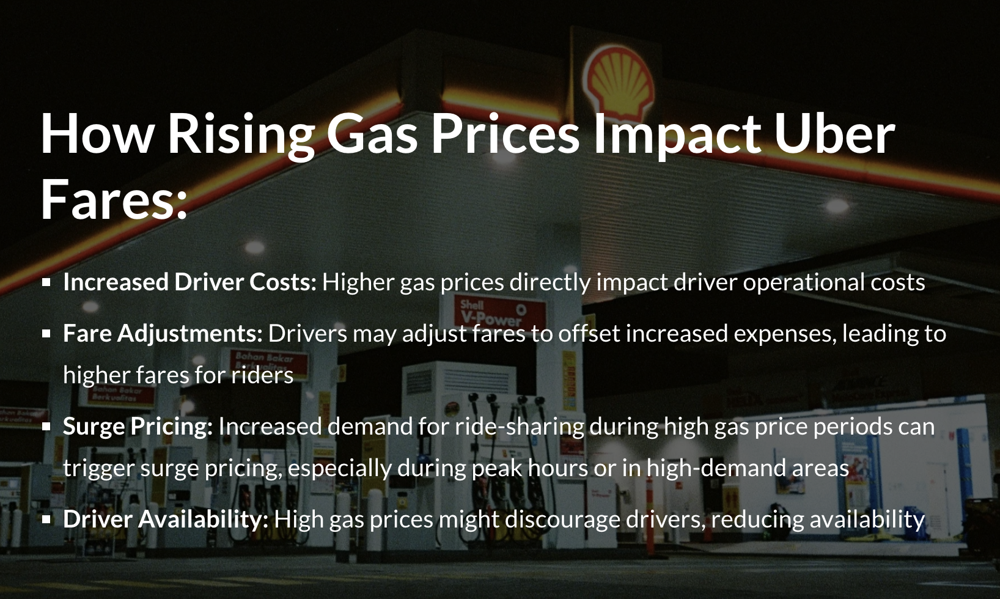
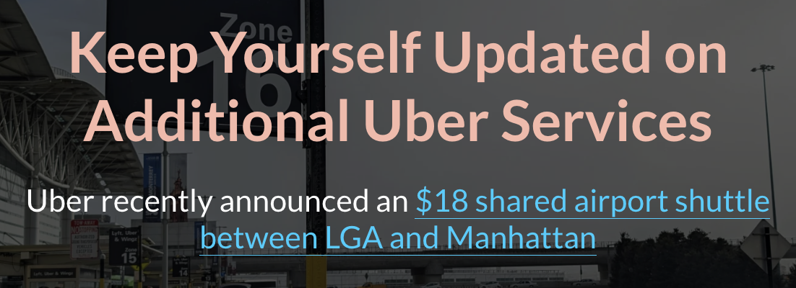
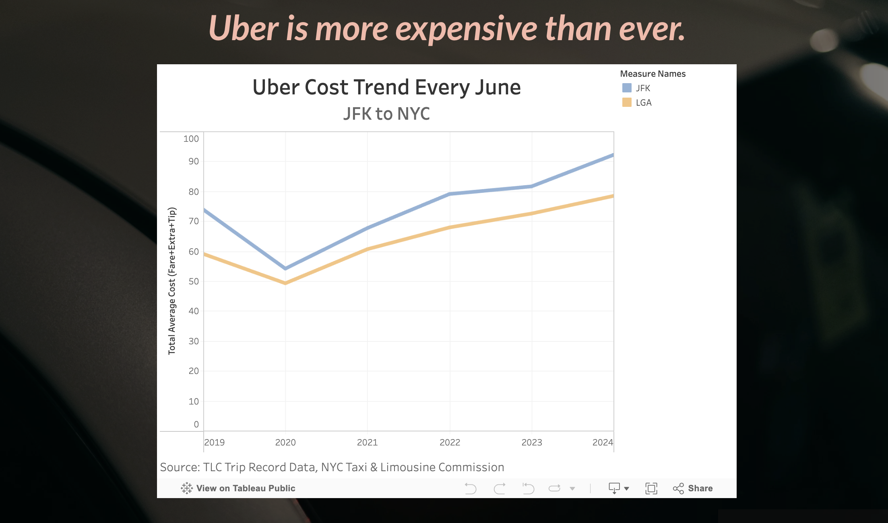
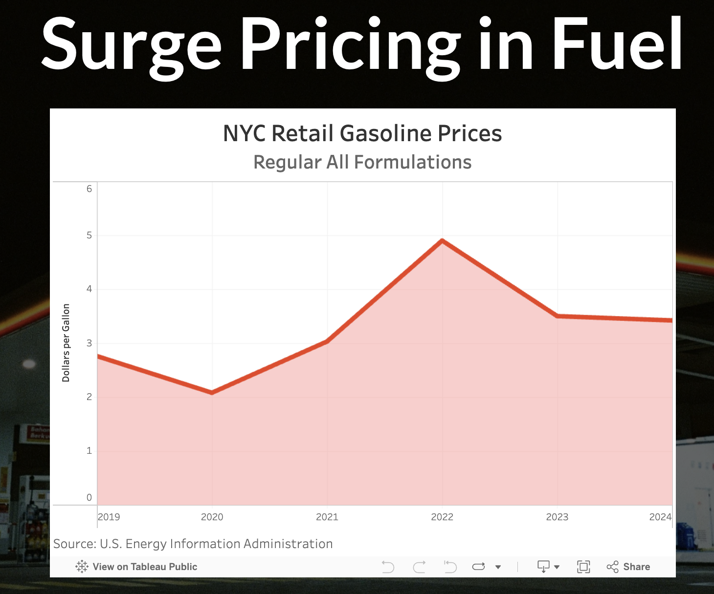
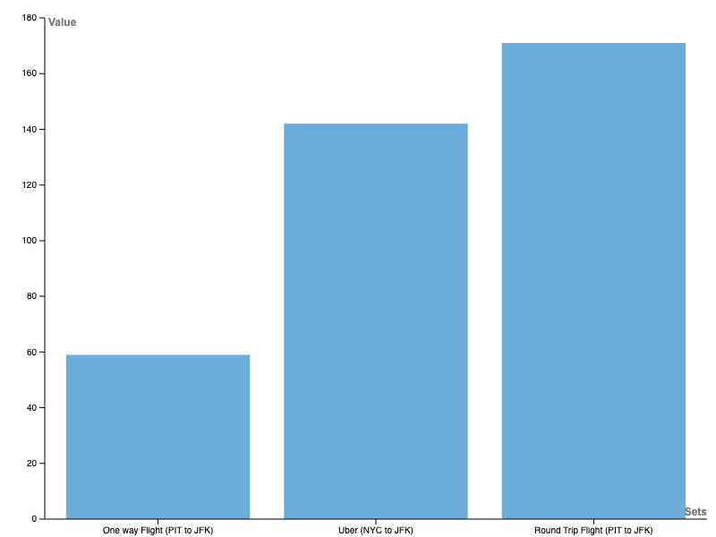
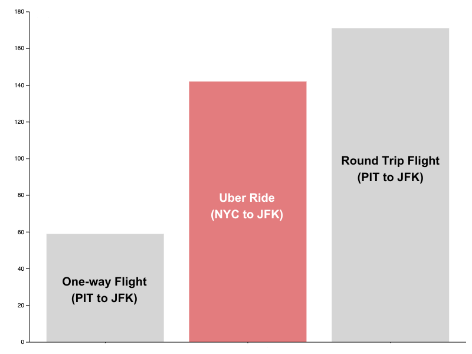

---
---

# Part III: Final Project

## [Final Project Link: Steady Increase in Uber Fares](https://carnegiemellon.shorthandstories.com/steady-increase-in-uber-fares-during-peak-season/index.html) 📈

## Final Project Summary ✍🏻

# Part I

When selecting a topic, I aimed to focus on something that the class could easily relate to and find interesting, while also revealing lesser-known facts. I chose to explore the steady increase in Uber fares over the years, providing a clear breakdown of the costs and uncovering the reasons behind these price hikes. Deciding on the location was more challenging, as I was torn between Pittsburgh and New York City. Ultimately, I chose NYC because the TLC (Taxi and Limousine Commission) provides a wealth of public data, breaking down transportation metrics by month, including taxis, for-hire rides, and more. This made New York City the perfect choice for my final project.

Since the TLC's annual dataset was too large for my laptop to download and process, I decided to focus on a specific month. After researching peak tourist seasons, I discovered that June is one of the highest-volume months for tourism in NYC. As a result, I chose June as the timeframe for analyzing Uber fares, gas prices, and other related data.

The next challenge was selecting the pick-up and drop-off locations within NYC. Given the city's robust metro system and my experience ubering between JFK, LGA, and other parts of Manhattan, I was able to narrow down the locations quickly. Although public transportation was an option, I often preferred Uber for its convenience, even though the fares never seemed to go down. I had also heard from friends that Uber fares in NYC had become absurdly high, which made me curious about why people were paying over $100 for a single ride. In that moment, I realized that this exploration would not only satisfy my own curiosity but also that of my classmates.

Before working on Part 2 & Part 3, I wanted to have at least a broad idea of my target audience since it would be helpful to narrow down the subtopics efficiently. I decided to focus on two groups: travelers or tourists who frequently use Uber for airport transportation, and New Yorkers or commuters interested in understanding the cost of air travel and the convenience of rideshare services.

While planning the data visualizations, I made sure to avoid overusing any particular type of chart. I consciously aimed to keep the variety of chart types in check, limiting each type to no more than three uses. Additionally, I thought carefully about color consistency, choosing a single color to emphasize key points throughout the visualizations. Moreover, I was exploring innovative ways that I could create unique types of data visualizations, not limiting myself only using Tableau.

# Part II

When I first started creating in Shorthand, I felt a bit lost navigating the platform, so it took me about a week or two to get fully comfortable with it. In addition, I was finding ways to convey the story to the audience, and even though it took time, I eventually stabilized the narrative by identifying the key factors to highlight. I had 7 main subtopics I wanted to cover: NYC tourist fun facts, Uber fare trends, Uber fare breakdown, gas price trends, gas breakdown, inflation trends, and a call to action. While I initially planned to include a gas breakdown, I ultimately removed it, as it seemed irrelevant to the core message. Although it might have offered an interesting insight, I chose to focus more on the underlying reasons behind the steady rise in Uber fares. That said, I did create pie charts for the gas breakdown, which turned out to be a valuable learning experience.

For the target audience, I provided a detailed breakdown, including age range, geographic location, and one personality trait to help me better focus and tailor my message. This approach also guided me in selecting the right interviewees. During the interviews, I primarily asked about the data visualization I was working on, the target audience, and their experiences when visiting NYC. This interview process proved to be invaluable, as it provided me with useful insights to refine both the data visualizations and the content.

Additionally, creating the moodboard allowed me to explore potential images that I could use alongside the graphs and content on Shorthand.

# Part III

I struggled a bit with the order of the subtopics, especially when it came to the Uber fare trend and the Uber fare breakdown. At first, I planned to introduce the Uber fare trend first, but in the end, I decided to place the Uber fare breakdown before it for a smoother transition.

I was also particular about choosing the background for each Shorthand page. Initially, I considered using only Uber-related images, but I ultimately decided on backgrounds that were not distracting from the graphs and content, while still being relevant to each subtopic.

Moreover, I considered adding more subtopics, like congestion pricing or surge pricing, and explaining how they work. However, I felt these topics were a bit too distant from the main themes I wanted to focus on.

## Final Data Story 📓

### Changes I Made Since Part II ✔️

- I rearranged the subtopics and used less complex Shorthand features.

- I added citations for all of my facts and research on the bottom of the page under "Reference."

- Rather than writing lengthy paragraphs, I aimed to convert the information into data visualizations. I also prioritized using bullet points over long blocks of text to enhance readability and clarity.

- I removed the gas price breakdown since it was irrelevant.

- I changed some of the background images to align with each subtopic instead of making everything related to Uber.

- I added a link for the new $18 Uber airport shuttle between NYC and LGA.

- I resized the data visualizations created on Tableau so that they would not fill the entire screen.

- I tried to place each data visualization under a title, subtitle, or an important fact.

- I added labels to the bars on the x-axis to make the variables more impactful. Additionally, I changed the color of the Uber fare section to light red and the others to gray so that I could emphasize the Uber fare.

### The Audience 👥

My target audience consists of travelers and tourists who often use Uber for airport transportation in June, as well as New Yorkers and commuters interested in the cost of rideshare services. The interview helped me narrow down my audience, as discussing the rise in Uber fares can be a broad topic. With this focus, I aimed to address the central question: "Why do Uber fares keep increasing?" Understanding my audience allowed me to tailor the content effectively, which in turn helped me deliver a more impactful presentation.

### Design Decisions 🎨

In terms of design, I aimed for a balance between simplicity and aesthetics to create an impactful experience during my 1-minute presentation. I avoided overwhelming the slides with text, focusing instead on a clean and appealing design that would resonate with the audience. Aligning the background of each section with the topic was key, such as using a picture of the Statue of Liberty when discussing interesting facts about visitors in NYC, which helped reinforce the theme. This approach minimized eye movement and allowed me to highlight the key message more effectively.

# Final thoughts 🤔

Given the data overload in our society, it is critical to transform complex numbers into simple visualizations, and this project made me appreciate the significance of perspective in storytelling. Furthermore, the multi-stage nature of this project helped me learn how to strategically plan and craft a narrative that leaves a lasting impression.

## References Part I, Part II, Part III 📖

- Sea the City. "When Is the Best Time to Visit New York City?" Last modified November 23, 2024. [https://www.seathecity.com/when-is-the-best-time-to-visit-new-york-city/#:~:text=The%20peak%20tourism%20season%20in,the%20accommodations%20sell%20out%20quickly](https://www.seathecity.com/when-is-the-best-time-to-visit-new-york-city/#:~:text=The%20peak%20tourism%20season%20in,the%20accommodations%20sell%20out%20quickly).

- Blade. "JFK to LGA." Accessed  November 23, 2024. [https://www.blade.com/jfk-to-lga](https://www.blade.com/jfk-to-lga).

- IRoad Genius. "Tourism Statistics for New York."  November 23, 2024. [https://roadgenius.com/statistics/tourism/usa/new-york/#How_many_tourists_visit_New_York_each_year](https://roadgenius.com/statistics/tourism/usa/new-york/#How_many_tourists_visit_New_York_each_year).

- New York City Taxi and Limousine Commission. "TLC Trip Record Data." Accessed  November 23, 2024. [https://www.nyc.gov/site/tlc/about/tlc-trip-record-data.page](https://www.nyc.gov/site/tlc/about/tlc-trip-record-data.page).

- New York City Taxi and Limousine Commission. "Data Dictionary: Trip Records HVFHS." [https://www.nyc.gov/assets/tlc/downloads/pdf/data_dictionary_trip_records_hvfhs.pdf](https://www.nyc.gov/assets/tlc/downloads/pdf/data_dictionary_trip_records_hvfhs.pdf).

- Microsoft Power BI. "TLC Trip Data Dashboard." Accessed  November 23, 2024. [https://app.powerbigov.us/view?r=eyJrIjoiY2FlNjI3YWQtMDkzOS00MjliLTk0MTQtODc2NzU4OTYwNjFiIiwidCI6IjMyZjU2ZmM3LTVmODEtNGUyMi1hOTViLTE1ZGE2NjUxM2JlZiJ9&pageName=ReportSection28c004ce23fc37acd783](https://app.powerbigov.us/view?r=eyJrIjoiY2FlNjI3YWQtMDkzOS00MjliLTk0MTQtODc2NzU4OTYwNjFiIiwidCI6IjMyZjU2ZmM3LTVmODEtNGUyMi1hOTViLTE1ZGE2NjUxM2JlZiJ9&pageName=ReportSection28c004ce23fc37acd783).

- Goldstein, Joe, and Michael Schwirtz. "Uber and Lyft Have Raised Their Prices, but New York’s Fares Are Still Among the Cheapest." The New York Times, January 3, 2020. [https://www.nytimes.com/2020/01/03/nyregion/uber-lyft-price.html](https://www.nytimes.com/2020/01/03/nyregion/uber-lyft-price.html).

- Uber Technologies, Inc. "Uber Dynamic Pricing." [https://www.uber.com/en-GB/blog/uber-dynamic-pricing/](https://www.uber.com/en-GB/blog/uber-dynamic-pricing/).

- NYC United Limo. "Is Car Service Cheaper Than Uber in NYC?" Accessed  November 23, 2024. [https://nycunitedlimo.com/is-car-service-cheaper-than-uber-in-nyc/](https://nycunitedlimo.com/is-car-service-cheaper-than-uber-in-nyc/).

- U.S. Energy Information Administration. "Historical Gasoline Prices in the U.S. (New York Harbor)." Accessed  November 25, 2024. [https://www.eia.gov/dnav/pet/hist/LeafHandler.ashx?n=PET&s=EMM_EPMR_PTE_Y35NY_DPG&f=M](https://www.eia.gov/dnav/pet/hist/LeafHandler.ashx?n=PET&s=EMM_EPMR_PTE_Y35NY_DPG&f=M).

- U.S. Inflation Calculator. "Current Inflation Rates: U.S. Inflation Calculator." Accessed  November 23, 2024. [https://www.usinflationcalculator.com/inflation/current-inflation-rates/](https://www.usinflationcalculator.com/inflation/current-inflation-rates/).

- Quora. "What Percentage Cut Does Uber Take from the Total Fare Cost of a Ride? Do They Subtract a Flat Fee for Each Dispatch or a Percentage? Are There Initiation or Monthly Fees to Be a Driver?" Accessed  November 27, 2024. [https://www.quora.com/What-percentage-cut-does-Uber-take-from-the-total-fare-cost-of-a-ride-Do-they-subtract-a-flat-fee-for-each-dispatch-or-a-percentage-Are-there-initiation-monthly-fees-to-be-a-driver](https://www.quora.com/What-percentage-cut-does-Uber-take-from-the-total-fare-cost-of-a-ride-Do-they-subtract-a-flat-fee-for-each-dispatch-or-a-percentage-Are-there-initiation-monthly-fees-to-be-a-driver).

- Uber Technologies, Inc. "LaGuardia Airport Shuttle." Accessed December 1, 2024. [https://www.uber.com/global/en/r/airports/lga/shuttle/](https://www.uber.com/global/en/r/airports/lga/shuttle/).

- Unsplash. "A Car Parked in Front of an Airport." Last modified December 3, 2024. [https://unsplash.com/photos/a-car-parked-in-front-of-an-airport-zNeCv-nM7i0](https://unsplash.com/photos/a-car-parked-in-front-of-an-airport-zNeCv-nM7i0).

- Check City. "What Causes Inflation in the Economy?" Accessed December 3, 2024. [https://www.checkcity.com/personal-finance/what-causes-inflation-in-the-economy](https://www.checkcity.com/personal-finance/what-causes-inflation-in-the-economy).

- Unsplash. "A Gas Station at Night with a Lit-Up Gas Station." Last modified December 1, 2024. [https://unsplash.com/photos/a-gas-station-at-night-with-a-lit-up-gas-station-XrwoxDC2IK4](https://unsplash.com/photos/a-gas-station-at-night-with-a-lit-up-gas-station-XrwoxDC2IK4).

- Unsplash. "A Close-Up of a Car's Tail Light." Last modified November 23, 2024. [https://unsplash.com/photos/a-close-up-of-a-cars-tail-light-3HL4_w75YgE](https://unsplash.com/photos/a-close-up-of-a-cars-tail-light-3HL4_w75YgE).

- Unsplash. "1 USA Dollar Banknotes." Last modified December 2, 2024. [https://unsplash.com/photos/1-usa-dollar-banknotes-8lnbXtxFGZw](https://unsplash.com/photos/1-usa-dollar-banknotes-8lnbXtxFGZw).

- Pixabay. "Statue of Liberty, New York." Last modified December 1, 2024. [https://pixabay.com/photos/statue-of-liberty-new-york-statue-267949/](https://pixabay.com/photos/statue-of-liberty-new-york-statue-267949/).

- Unsplash. "A Large Sign on Top of a Large Building." Last modified December 1, 2024. [https://unsplash.com/photos/a-large-sign-on-top-of-a-large-building-Pea2f-U-fnY](https://unsplash.com/photos/a-large-sign-on-top-of-a-large-building-Pea2f-U-fnY).

- Lerman, Rachel. "Inflation Is Driving Up Costs for Gig Economy Workers. Here's How They’re Coping." The Washington Post, August 7, 2022. [https://www.washingtonpost.com/technology/2022/08/07/gig-economy-inflation/](https://www.washingtonpost.com/technology/2022/08/07/gig-economy-inflation/).

- Browning, Kellen. "Why Gas Prices Are Driving Uber and Lyft Prices Higher." The New York Times, March 17, 2022. [https://www.nytimes.com/2022/03/17/technology/gas-prices-uber-lyft-drivers.html](https://www.nytimes.com/2022/03/17/technology/gas-prices-uber-lyft-drivers.html).

- Palmer, Annie. "Soaring Gas Prices Are Forcing Some Uber, Lyft Drivers off the Road." CNBC, April 13, 2022. [https://www.cnbc.com/2022/04/13/soaring-gas-prices-are-forcing-some-uber-lyft-drivers-off-the-road.html](https://www.cnbc.com/2022/04/13/soaring-gas-prices-are-forcing-some-uber-lyft-drivers-off-the-road.html).

- Uber. "New Fuel Surcharge." Uber Newsroom. Accessed December 1, 2024. [https://www.uber.com/newsroom/new-fuel-surcharge/#:~:text=While%20earnings%20on%20our%20platform,out%20a%20temporary%20fuel%20surcharge](https://www.uber.com/newsroom/new-fuel-surcharge/#:~:text=While%20earnings%20on%20our%20platform,out%20a%20temporary%20fuel%20surcharge).

- Fuel Logic. "How U.S. Gas Prices Affect the Overall Economy." Accessed December 1, 2024. [https://www.fuellogic.net/how-us-gas-prices-affect-the-overall-economy/#:~:text=Fluctuations%20in%20crude%20oil%20prices,distribution%20costs%20also%20impact%20prices](https://www.fuellogic.net/how-us-gas-prices-affect-the-overall-economy/#:~:text=Fluctuations%20in%20crude%20oil%20prices,distribution%20costs%20also%20impact%20prices).

- Google Flights. Accessed December 1, 2024. [https://www.google.com/travel/flights?sca_esv=31e750890f4bca3b&rlz=1C5CHFA_enKR1057KR1065&sxsrf=ADLYWIJsvLlPtWYLJ9QsyJ1wjxt5NfFHiA%3A1733548109776&source=flun&uitype=cuAA&hl=en&gl=us&curr=USD&tfs=CAEQAhoeEgoyMDI1LTAxLTA5agcIARIDUElUcgcIARIDSkZLGh4SCjIwMjUtMDEtMTNqBwgBEgNKRktyBwgBEgNQSVR6aENqUklMWE5FT1hkZk4yeFpWRUZCUTNaV2JsRkNSeTB0TFMwdExTMHRMUzEyZDNsak5FRkJRVUZCUjJSVU1rVXdUbmxvWTJkQkVnTnVRVUVhQ3dqTWhRRVFBaG9EVlZORU9EQnd6SVVC](https://www.google.com/travel/flights?sca_esv=31e750890f4bca3b&rlz=1C5CHFA_enKR1057KR1065&sxsrf=ADLYWIJsvLlPtWYLJ9QsyJ1wjxt5NfFHiA%3A1733548109776&source=flun&uitype=cuAA&hl=en&gl=us&curr=USD&tfs=CAEQAhoeEgoyMDI1LTAxLTA5agcIARIDUElUcgcIARIDSkZLGh4SCjIwMjUtMDEtMTNqBwgBEgNKRktyBwgBEgNQSVR6aENqUklMWE5FT1hkZk4yeFpWRUZCUTNaV2JsRkNSeTB0TFMwdExTMHRMUzEyZDNsak5FRkJRVUZCUjJSVU1rVXdUbmxvWTJkQkVnTnVRVUVhQ3dqTWhRRVFBaG9EVlZORU9EQnd6SVVC).

- Uber Technologies. Uber. Mobile app. Version 2024. iOS/Android. Accessed December 1, 2024.

-  Uber Technologies, Inc. "How to Beat Surge Pricing in Alexandria." Uber Blog, April 27, 2022. [https://www.uber.com/en-EG/blog/beat-surge-in-alexandria/](https://www.uber.com/en-EG/blog/beat-surge-in-alexandria/).

-  Kimberly, Marie. "JFK Airport to and from Brooklyn." TripSavvy, May 28, 2020. [https://www.tripsavvy.com/jfk-airport-to-and-from-brooklyn-441574](https://www.tripsavvy.com/jfk-airport-to-and-from-brooklyn-441574).

-  Gali. Jordi. and David López-Salido. "Monetary Policy Responses to Post-Pandemic Inflation: Challenges and Lessons for the Future." VoxEU. Center for Economic and Policy Research. August 4. 2022. [https://cepr.org/voxeu/columns/monetary-policy-responses-post-pandemic-inflation-challenges-and-lessons-future](https://cepr.org/voxeu/columns/monetary-policy-responses-post-pandemic-inflation-challenges-and-lessons-future).

-  Federal Reserve. "Inflationary Pressures and Their Impact on the U.S. Economy." Federal Reserve Report, August 2021. [https://www.federalreserve.gov](https://www.federalreserve.gov).

-  U.S. Bureau of Labor Statistics. "What Caused the High Inflation During the COVID-19 Period?" Monthly Labor Review, 2023. [https://www.bls.gov/opub/mlr/2023/beyond-bls/what-caused-the-high-inflation-during-the-covid-19-period.htm#:~:text=The%20combined%20effects%20of%20increased,through%20the%20end%20of%202022](https://www.bls.gov/opub/mlr/2023/beyond-bls/what-caused-the-high-inflation-during-the-covid-19-period.htm#:~:text=The%20combined%20effects%20of%20increased,through%20the%20end%20of%202022).

- U.S. Bureau of Labor Statistics. "Purchasing Power and Constant Dollars." Consumer Price Index Fact Sheets. Accessed December 1, 2024. [https://www.bls.gov/cpi/factsheets/purchasing-power-constant-dollars.htm](https://www.bls.gov/cpi/factsheets/purchasing-power-constant-dollars.htm).

## Navigate 
| [home page](https://celerysally.github.io/portfolio/README.md) | [visualizing debt](https://celerysally.github.io/portfolio/visualizing_debt.html) | [critique by design](https://celerysally.github.io/portfolio/critique_by_design.html) | [Final Project Part I](https://celerysally.github.io/portfolio/Part1FinalProject.html) | [Final Project Part II](https://celerysally.github.io/portfolio/part2.html) |
