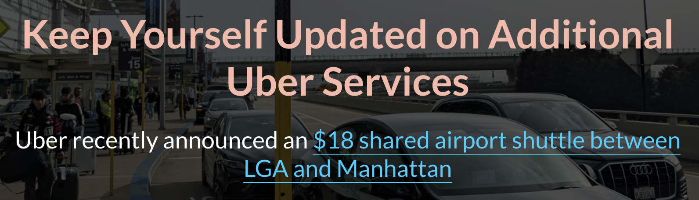

---
---

# Part III: Final Project

## [Steady Increase in Uber Fares](https://carnegiemellon.shorthandstories.com/steady-increase-in-uber-fares-during-peak-season/index.html)

## Final data story 

### Changes made since Part II ✔️

- I rearranged the subtopics and used less complex Shorthand features.

- I removed the gas price breakdown since it was irrelevant.

- I changed some of the background images to align with each subtopic instead of making everything related to Uber.

- I added a link for the new $18 Uber airport shuttle between NYC and LGA.

- I reduced the size of the data visualizations created on Tableau not to a full-screen size.
  

- I tried to place each data visualization under a title, subtitle, or an important fact.

- I added labels to the bars on the x-axis to make the variables more impactful. Additionally, I changed the color of the Uber fare section to light red and the others to gray so that I could emphasize the Uber fare.

  

### The audience 👥

My target audience consists of travelers and tourists who often use Uber for airport transportation in June, as well as New Yorkers and commuters interested in the cost of rideshare services. The interview helped me narrow down my audience, as discussing the rise in Uber fares can be a broad topic. With this focus, I aimed to address the central question: "Why do Uber fares keep increasing?" Understanding my audience allowed me to tailor the content effectively, which in turn helped me deliver a more impactful presentation.

### Design Decisions 🎨

In terms of design, I aimed for a balance between simplicity and aesthetics to create an impactful experience during my 1-minute presentation. I avoided overwhelming the slides with text, focusing instead on a clean and appealing design that would resonate with the audience. Aligning the background of each section with the topic was key, such as using a picture of the Statue of Liberty when discussing interesting facts about visitors in NYC, which helped reinforce the theme. This approach minimized eye movement and allowed me to highlight the key message more effectively.

## References

# Final thoughts

## Navigate 
| [home page](https://celerysally.github.io/portfolio/README.md) | [visualizing debt](https://celerysally.github.io/portfolio/visualizing_debt.html) | [critique by design](https://celerysally.github.io/portfolio/critique_by_design.html) | [Final Project Part I](https://celerysally.github.io/portfolio/Part1FinalProject.html) | [Final Project Part II](https://celerysally.github.io/portfolio/part2.html) |
